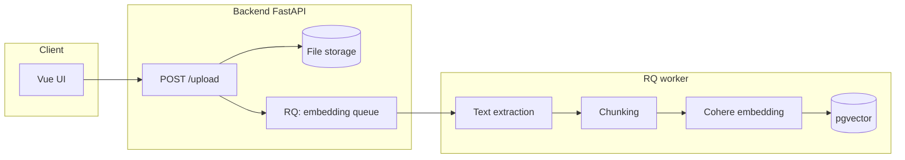
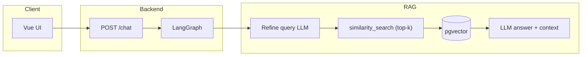

<div id="top">

<div align="center">

# DOCUMENT RAG CHATBOT

<em>Document-based chat with Retrieval-Augmented Generation</em>

<em>FastAPI · LangGraph · pgvector · Vue 3</em>

<em>Built with:</em>


<br>


</div>

---

## Overview

A **Retrieval-Augmented Generation (RAG)** application: upload documents, **chunks** are stored in **pgvector**, and conversations use **LangGraph** (query refinement → context retrieval → answer) with **streaming** via **FastAPI** and a **Vue 3** UI.

The backend is **API-first** and can be exercised through the local UI or any other HTTP client; interactive documentation is available at `/docs`.

**This document** satisfies the required technical documentation.

---

## Project status

**Active development** — an assignment / learning project with an architecture that separates **UI**, **API**, **embedding worker**, and **vector storage**, with emphasis on observability (logging, optional LangSmith).

---

## System architecture

| Layer | Technology | Role |
|--------|-----------|--------|
| Client | **Vue 3** + Vite, Tailwind | Chat UI, file upload, streaming responses |
| API | **FastAPI** | `POST /upload`, `POST /chat`, `GET /health`, `GET/PUT /prompt-templates`, history & upload jobs |
| RAG orchestration | **LangGraph** | Graph: `refine_query` → `get_relevant_docs` → `response` |
| Job queue | **Redis** + **RQ** | Background document embedding (API stays responsive) |
| Vector storage & history | **PostgreSQL 16** + **pgvector** (via `langchain-postgres`) | Chunk vectors + **PostgresChatMessageHistory** |
| LLM | **Groq** (`langchain-groq`, `ChatGroq`) | Text inference (model configured in code & environment variables) |
| Embedding | **Cohere** (`langchain-cohere`) | Chunk vectorization for similarity search |
| PDF extraction | **pymupdf4llm** | PDF → Markdown before chunking |
| Observability (optional) | **LangSmith** | LangChain/LangGraph run tracing when enabled |

**Docker Compose services** (see `docker-compose.yml`): `frontend`, `backend`, `worker` (RQ), `job_queue` (Redis), `database` (pgvector), optional `database_admin` (pgAdmin).

---

## Data flow diagrams

The diagrams below use **Mermaid** (as in the previous version); there are no separate PNG image assets in this repository.

### Document upload flow



### Conversation (chat / RAG) flow



In short: **upload** fills the knowledge base **asynchronously**; **chat** reads session history, refines the question for retrieval, fetches the **top-k** nearest chunks, then produces an answer (SSE streaming).

---

## High-level repository layout

```text
.
├── backend/
│   └── app/
│       ├── agent/           # LangGraph: refine → retrieve → response
│       ├── api/             # FastAPI (chat, upload, health)
│       ├── eval/            # RAG evaluation CLI (RAGAS)
│       ├── rag/             # Extraction, chunking, document transforms
│       ├── services/        # Embedding, LLM, DB, queue
│       └── workers/         # RQ: file embedding → pgvector
├── frontend/                # Vue 3 + Vite
├── docker-compose.yml
└── .env.example
```

---

## Features

- **LangGraph RAG flow** — `refine_query` → `get_relevant_docs` → `response`, with structured output for query refinement.
- **Document upload & async embedding** — the API does not block on embedding; work is queued in **Redis/RQ**.
- **Streaming chat (SSE)** — incremental responses to the client.
- **pgvector + Postgres** — one database for vectors and conversation history.
- **Multimodel cloud** — **Groq** (LLM) and **Cohere** (embedding), configurable via `.env`.
- **Observability** — standard Python logging + optional **LangSmith** for chain traces.

---

## RAG pipeline and chunking strategy

1. **Extraction** — `text/plain`: read file as UTF-8. Other formats (e.g. PDF): converted to Markdown with `pymupdf4llm.to_markdown` so heading/list structure is preserved before splitting.
2. **Chunking** — implementation in `backend/app/rag/chunker.py`:
   - **`text/plain`**: `RecursiveCharacterTextSplitter` — hierarchical splitting (tiered separators) so chunks do not arbitrarily split sentences compared to naive fixed-width cuts.
   - **Other types** (after Markdown extraction): `MarkdownTextSplitter` — sensible boundaries on structured Markdown documents.
   - Shared parameters: **`chunk_size=512`**, **`chunk_overlap=64`** — overlap preserves context continuity across chunk boundaries (reduces risk of answers breaking on terms cut at chunk edges).
3. **Embedding & storage** — each chunk becomes a LangChain document with metadata (`file_name`, `path`, `content_type`), written to **pgvector** via the worker.
4. **Retrieval** — user query (after LLM **refine** step) runs as **`similarity_search`** with **`k = RETRIEVAL_TOP_K`** (value from environment; see `.env.example`).
5. **Generation** — system prompt + history + document snippets are sent to the LLM for the final answer.

---

## Model and technology choices (brief rationale)

| Choice | Practical reason |
|--------|----------------|
| **Groq + ChatGroq** | Low-latency inference for interactive chat; ready-made LangChain integration; retries on transient failures (`BadRequestError`). |
| **Cohere embeddings** | Multilingual model (`embed-multilingual-v3.0` default) suits mixed-language documents; vector dimension tied to **`VECTOR_EMBEDDING_DIMENSION`** for consistency with the pgvector schema. |
| **PostgreSQL + pgvector** | One database for vectors and **chat history** (Postgres); fewer separate services than adding a dedicated vector-only stack. |
| **Redis + RQ** | Lightweight queue for heavy embedding; **enqueue → worker** pattern keeps upload API responses fast. |
| **LangGraph** | RAG as an explicit graph (refine → retrieve → answer), easy to trace and extend. |
| **Vue + Vite** | Modern UI with streaming and upload forms without a heavy dev bundler setup. |

The agent node LLM currently uses **`openai/gpt-oss-120b`** (Groq) for structured refinement and answers; **`LLM_MODEL`** remains relevant for default `get_language_model` configuration elsewhere.

---

## Logging and observability

- **Application logging:** Python `logging` module (loggers under **`uvicorn.error`**) on routes and services — e.g. chat history load failures, table initialization, and **health** paths that log component status.
- **LangSmith:** set **`LANGSMITH_TRACING_V2=true`** and fill **`LANGSMITH_API_KEY`** / **`LANGSMITH_PROJECT`** (see `.env.example`) to trace LangChain/LangGraph chains in the LangSmith dashboard.

---

## Running the project (step by step)

### Prerequisites

- **Docker** and **Docker Compose**
- **Groq** and **Cohere** API keys (required for LLM and embedding)

### Steps

1. **Copy the environment file**

   ```bash
   cp .env.example .env
   ```

2. **Fill in `.env`** — at minimum:

   - `GROQ_API_KEY`, `COHERE_API_KEY`
   - `POSTGRES_USER`, `POSTGRES_PASSWORD`, `POSTGRES_DB` (match `docker-compose`)
   - `VECTOR_EMBEDDING_DIMENSION` — must match the embedding model (e.g. **1024** for `embed-multilingual-v3.0`)
   - `EMBEDDING_MODEL`, `LLM_MODEL` as needed
   - `RETRIEVAL_TOP_K` — number of top chunks for retrieval (example default in `.env.example`)

3. **Start the stack**

   ```bash
   docker compose up --build
   ```

4. **Open the app**

   - Frontend: **http://localhost:5173**
   - Backend API: **http://localhost:8000**
   - Interactive API docs: **http://localhost:8000/docs**
   - Service health: **GET http://localhost:8000/health**

5. **Optional — pgAdmin** (`database_admin` service) — use credentials from `.env` for SQL/pgvector testing in development.

Without Docker you must set up Postgres (+ pgvector extension), Redis, run the RQ worker, and start backend/frontend manually; Compose is the fully supported path in this repository.

### Quick chat test

```bash
curl -X POST 'http://localhost:8000/chat' \
  -H 'Content-Type: application/json' \
  -d '{"chat_input": "Summarize the uploaded documents.", "session_id": null}'
```

(Adjust the payload to the actual schema in `/docs` — e.g. streaming needs an SSE-capable client.)

### RAG evaluation (RAGAS)

After documents are indexed in pgvector, run the eval command from the **`backend/`** directory after `uv sync` so the `app` package is installed in the project venv. Variables such as **`COHERE_API_KEY`**, **`GROQ_API_KEY`**, and Postgres must be set — same as the API service. The CLI loads `.env` from several locations; values already exported in the shell are not overridden.

From **`backend/`**:

```bash
uv run python -m app.eval.ragas_cli --output app/eval/ragas_report.json
```

(Default `--questions` is `app/eval/questions.sample.json` next to the CLI module; override with `--questions path/to/file.json` if needed.)

Copy `app/eval/questions.sample.json` and fill the `questions` list with your test questions. Console output includes aggregate **faithfulness** and **answer_relevancy**; the `--output` file stores per-row scores and a summary.

---

## Technical trade-offs

| Decision | Benefit | Cost / risk |
|-----------|---------|----------------|
| **Cloud APIs (Groq, Cohere)** | No local GPU, fast iteration | API cost, network dependency, vendor policy |
| **Async embedding (RQ)** | Fast upload responses | Chunk/embedding status is **eventually consistent**; users must wait for jobs to finish before asking with full coverage |
| **Chunk 512 + overlap 64** | Balance of context vs granularity | Too large/small chunks for some doc types can be tuned later |
| **Fixed top-k** | Simple and explainable | No built-in reranking or advanced metadata filtering |
| **Single global vector index** | Simple implementation | Retrieval does not automatically scope by document per session (see limitations) |

---

## System limitations

- Requires **internet access** to Groq and Cohere.
- **Retrieval** is currently similarity search over **all stored chunks**; per-document/session filtering is not enforced in the default code path.
- **Answer quality** depends on PDF→Markdown extraction quality and on very long or highly structured documents.
- External API **quotas and rate limits** can constrain production load.
- **pgAdmin** exposes port **80** on the host — change it if it conflicts with other services.

---

## Future development

- Deeper RAG evaluation (larger datasets, extra metrics, or structured manual reports) and tuning **top-k** / reranking. A basic **RAGAS** CLI already exists (see **RAG evaluation (RAGAS)**).
- Retrieval filtering by **metadata** (e.g. only documents uploaded in a given session).
- External prompt management (file/DB) and **model routing** options for different question types.
- Centralized observability (metrics, per-request trace IDs) beyond optional LangSmith.

---

## Quick API reference

| Method | Path | Description |
|--------|------|-------------|
| `POST` | `/upload` | Upload document (background embedding) |
| `POST` | `/upload/batch` | Upload multiple files |
| `GET` | `/upload/jobs` | Embedding job status |
| `POST` | `/chat` | Chat with streaming |
| `GET` | `/chat/history` | Session conversation history |
| `GET` | `/health` | Embedding, LLM, DB, storage, worker status |

---

## Notes for contributors

- Clarity of the RAG flow and API contracts is preferred over implicit “magic”.
- Changes to chunking, retrieval, or prompts directly affect answer quality — document trade-offs in the README or PR.

<br>

<div align="left"><a href="#top">⬆ Back to top</a></div>

</div>
