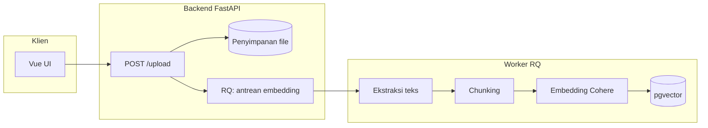
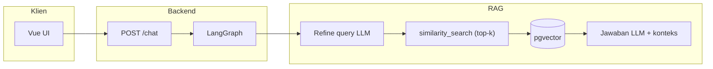

<div id="top">

<div align="center">

# DOCUMENT RAG CHATBOT

<em>Chat berbasis dokumen dengan Retrieval-Augmented Generation</em>

<em>FastAPI · LangGraph · pgvector · Vue 3</em>

<em>Built with:</em>


<br>


</div>

---

## Overview

Aplikasi **Retrieval-Augmented Generation (RAG)**: unggah dokumen, **chunks** disimpan di **pgvector**, percakapan memakai **LangGraph** (perapihan query → pengambilan konteks → jawaban) dengan **streaming** lewat **FastAPI** dan antarmuka **Vue 3**.

Backend bersifat **API-first** dan dapat diuji lewat UI lokal atau klien HTTP lain; dokumentasi interaktif tersedia di `/docs`.

**Isi dokumen ini** memenuhi kebutuhan dokumentasi teknis wajib (arsitektur, alur data, pipeline RAG, strategi chunking, alasan pilihan teknologi, cara menjalankan, trade-off, keterbatasan, rencana pengembangan, serta logging/observability).

---

## Project status

**Pengembangan aktif** — proyek penugasan / pembelajaran dengan arsitektur yang memisahkan **UI**, **API**, **worker embedding**, dan **penyimpanan vektor**, serta penekanan pada observabilitas (logging, opsional LangSmith).

---

## Arsitektur sistem

| Lapisan | Teknologi | Peran |
|--------|-----------|--------|
| Klien | **Vue 3** + Vite, Tailwind | UI chat, unggah file, streaming respons |
| API | **FastAPI** | `POST /upload`, `POST /chat`, `GET /health`, histori & pekerjaan unggah |
| Orkestrasi RAG | **LangGraph** | Graf: `refine_query` → `get_relevant_docs` → `response` |
| Antrean pekerjaan | **Redis** + **RQ** | Embedding dokumen di latar belakang (API tetap responsif) |
| Penyimpanan vektor & histori | **PostgreSQL 16** + **pgvector** (via `langchain-postgres`) | Vektor chunk + **PostgresChatMessageHistory** |
| LLM | **Groq** (`langchain-groq`, `ChatGroq`) | Inferensi teks (model dikonfigurasi di kode & variabel lingkungan) |
| Embedding | **Cohere** (`langchain-cohere`) | Vektorisasi chunk untuk pencarian kemiripan |
| Ekstraksi PDF | **pymupdf4llm** | PDF → Markdown sebelum chunking |
| Observability (opsional) | **LangSmith** | Tracing run LangChain/LangGraph bila diaktifkan |

**Layanan Docker Compose** (lihat `docker-compose.yml`): `frontend`, `backend`, `worker` (RQ), `job_queue` (Redis), `database` (pgvector), opsional `database_admin` (pgAdmin).

---

## Diagram alur data

Diagram berikut memakai **Mermaid** (seperti versi sebelumnya); tidak ada aset gambar PNG terpisah di repositori ini.

### Alur unggah dokumen



### Alur percakapan (chat / RAG)



Ringkasnya: **unggah** mengisi basis pengetahuan secara **asinkron**; **chat** membaca histori sesi, menyempurnakan pertanyaan untuk retrieval, mengambil **top-k** chunk terdekat, lalu menghasilkan jawaban (streaming SSE).

---

## Struktur tinggi repositori

```text
.
├── backend/
│   └── app/
│       ├── agent/           # LangGraph: refine → retrieve → response
│       ├── api/             # FastAPI (chat, upload, health)
│       ├── rag/             # Ekstraksi, chunking, transformasi dokumen
│       ├── services/        # Embedding, LLM, DB, antrean
│       └── workers/         # RQ: embedding file → pgvector
├── frontend/                # Vue 3 + Vite
├── docker-compose.yml
└── .env.example
```

---

## Features

- **Alur RAG di LangGraph** — `refine_query` → `get_relevant_docs` → `response`, dengan output terstruktur untuk penyempurnaan query.
- **Unggah dokumen & embedding async** — API tidak memblokir pada embedding; pekerjaan di antrean **Redis/RQ**.
- **Streaming chat (SSE)** — respons bertahap ke klien.
- **pgvector + Postgres** — satu DB untuk vektor dan histori percakapan.
- **Multimodel cloud** — **Groq** (LLM) dan **Cohere** (embedding), dapat diatur lewat `.env`.
- **Observabilitas** — logging standar Python + **LangSmith** opsional untuk trace rantai.

---

## Pipeline RAG dan strategi chunking

1. **Ekstraksi** — `text/plain`: baca file sebagai UTF-8. Format lain (mis. PDF): dikonversi ke Markdown dengan `pymupdf4llm.to_markdown` agar struktur heading/daftar lebih terjaga sebelum dipotong.
2. **Chunking** — implementasi di `backend/app/rag/chunker.py`:
   - **`text/plain`**: `RecursiveCharacterTextSplitter` — memecah secara hierarkis (karakter pemisah berjenjang) sehingga potongan tidak “membelah” kalimat sembarangan dibanding pemotongan fixed-width naif.
   - **Tipe lain** (setelah ekstraksi Markdown): `MarkdownTextSplitter` — menjaga batas yang masuk akal pada dokumen ber-struktur Markdown.
   - Parameter bersama: **`chunk_size=512`**, **`chunk_overlap=64`** — overlap menjaga kontinuitas konteks di sekitar batas chunk (kurangi risiko jawaban yang terputus pada istilah yang terpotong di tepi chunk).
3. **Embedding & penyimpanan** — setiap chunk menjadi dokumen LangChain dengan metadata (`file_name`, `path`, `content_type`), ditulis ke **pgvector** melalui worker.
4. **Retrieval** — query pengguna (setelah langkah **refine** oleh LLM) dieksekusi sebagai **`similarity_search`** dengan **`k = RETRIEVAL_TOP_K`** (nilai dari lingkungan, lihat `.env.example`).
5. **Generasi** — prompt sistem + histori + cuplikan dokumen dikirim ke LLM untuk jawaban akhir.

---

## Pemilihan model dan teknologi (rationale singkat)

| Pilihan | Alasan praktis |
|--------|----------------|
| **Groq + ChatGroq** | Inferensi latensi rendah untuk chat interaktif; integrasi LangChain siap pakai; retry untuk kegagalan transient (`BadRequestError`). |
| **Cohere embeddings** | Model multilingual (`embed-multilingual-v3.0` default) cocok untuk dokumen campuran; dimensi vektor diikat **`VECTOR_EMBEDDING_DIMENSION`** agar konsisten dengan skema pgvector. |
| **PostgreSQL + pgvector** | Satu basis data untuk vektor dan **histori chat** (Postgres); mengurangi jumlah layanan terpisah dibanding stack vektor murni tambahan. |
| **Redis + RQ** | Antrean ringan untuk embedding berat; pola **enqueue → worker** memenuhi kebutuhan respons API cepat saat unggah. |
| **LangGraph** | Alur RAG sebagai graf eksplisit (refine → retrieve → jawab), mudah dilacak dan diperluas. |
| **Vue + Vite** | UI modern dengan streaming dan form unggah tanpa bundler berat untuk lingkungan pengembangan. |

Model LLM pada node agen saat ini memakai **`openai/gpt-oss-120b`** (Groq) untuk refine terstruktur dan jawaban; variabel **`LLM_MODEL`** tetap relevan untuk konfigurasi default `get_language_model` di tempat lain.

---

## Logging dan observability

- **Logging aplikasi:** modul `logging` Python (logger turunan **`uvicorn.error`**) pada rute dan layanan — misalnya kegagalan muat histori chat, inisialisasi tabel, serta jalur **health** yang mencatat status komponen.
- **LangSmith:** set **`LANGSMITH_TRACING_V2=true`** dan isi **`LANGSMITH_API_KEY`** / **`LANGSMITH_PROJECT`** (lihat `.env.example`) untuk tracing rantai LangChain/LangGraph di dashboard LangSmith.

---

## Menjalankan proyek (langkah demi langkah)

### Prasyarat

- **Docker** dan **Docker Compose**
- Kunci API **Groq** dan **Cohere** (wajib untuk LLM dan embedding)

### Langkah

1. **Salin berkas lingkungan**

   ```bash
   cp .env.example .env
   ```

2. **Isi `.env`** — minimal:

   - `GROQ_API_KEY`, `COHERE_API_KEY`
   - `POSTGRES_USER`, `POSTGRES_PASSWORD`, `POSTGRES_DB` (sesuai `docker-compose`)
   - `VECTOR_EMBEDDING_DIMENSION` — harus cocok dengan model embedding (mis. **1024** untuk `embed-multilingual-v3.0`)
   - `EMBEDDING_MODEL`, `LLM_MODEL` sesuai kebutuhan
   - `RETRIEVAL_TOP_K` — jumlah chunk teratas untuk retrieval (nilai default contoh di `.env.example`)

3. **Jalankan stack**

   ```bash
   docker compose up --build
   ```

4. **Buka aplikasi**

   - Frontend: **http://localhost:5173**
   - API backend: **http://localhost:8000**
   - Dokumentasi interaktif API: **http://localhost:8000/docs**
   - Kesehatan layanan: **GET http://localhost:8000/health**

5. **Opsional — pgAdmin** (layanan `database_admin`) — gunakan kredensial dari `.env` untuk pengujian SQL/pgvector di lingkungan pengembangan.

Tanpa Docker, Anda perlu menyiapkan Postgres (+ ekstensi pgvector), Redis, menjalankan worker RQ, serta backend/frontend secara manual; Compose adalah jalur yang didukung penuh oleh repositori ini.

### Contoh uji cepat (chat)

```bash
curl -X POST 'http://localhost:8000/chat' \
  -H 'Content-Type: application/json' \
  -d '{"chat_input": "Ringkas dokumen yang sudah diunggah.", "session_id": null}'
```

(Sesuaikan payload dengan skema aktual di `/docs` — misalnya streaming memakai client yang mendukung SSE.)

---

## Trade-off teknis

| Keputusan | Manfaat | Biaya / risiko |
|-----------|---------|----------------|
| **API cloud (Groq, Cohere)** | Tanpa GPU lokal, iterasi cepat | Biaya API, ketergantungan jaringan, kebijakan vendor |
| **Embedding async (RQ)** | Respons unggah cepat | Status chunk/embedding **akhirnya konsisten**; pengguna harus menunggu job selesai untuk bertanya penuh |
| **Chunk 512 + overlap 64** | Keseimbangan konteks vs granularitas | Chunk terlalu besar/kecil untuk jenis dokumen tertentu bisa dioptimalkan kemudian |
| **Top-k tetap** | Sederhana dan mudah dijelaskan | Tidak ada reranking atau filter metadata lanjutan secara bawaan |
| **Satu indeks vektor global** | Implementasi sederhana | Retrieval tidak memisahkan dokumen per sesi secara otomatis (lihat keterbatasan) |

---

## Keterbatasan sistem

- Membutuhkan **akses internet** ke penyedia Groq dan Cohere.
- **Retrieval** saat ini adalah pencarian kemiripan terhadap **seluruh chunk** yang tersimpan; penyaringan per dokumen/sesi tidak diwajibkan pada simpulan kode default.
- **Kualitas jawaban** bergantung pada kualitas ekstraksi PDF→Markdown dan pada dokumen yang sangat panjang atau sangat terstruktur.
- **Kuota dan rate limit** API eksternal dapat membatasi beban produksi.
- **pgAdmin** memaparkan port **80** pada host — sesuaikan jika bentrok dengan layanan lain.

---

## Rencana pengembangan ke depan

- Evaluasi RAG (mis. **RAGAS** atau evaluasi manual terstruktur) dan penyetelan **top-k** / reranking.
- Penyaringan retrieval berdasarkan **metadata** (mis. hanya dokumen yang diunggah dalam sesi tertentu).
- Manajemen prompt eksternal (file/DB) dan opsi **routing model** untuk jenis pertanyaan berbeda.
- Observability terpusat (metrik, trace ID permintaan) di luar LangSmith opsional.

---

## Referensi cepat API

| Metode | Path | Keterangan |
|--------|------|------------|
| `POST` | `/upload` | Unggah dokumen (embedding di latar belakang) |
| `POST` | `/upload/batch` | Unggah banyak file |
| `GET` | `/upload/jobs` | Status pekerjaan embedding |
| `POST` | `/chat` | Chat dengan streaming |
| `GET` | `/chat/history` | Histori percakapan sesi |
| `GET` | `/health` | Status embedding, LLM, DB, penyimpanan, worker |

---

## Catatan untuk kontributor

- Kejelasan alur RAG dan kontrak API lebih diutamakan daripada “sihir” implisit.
- Perubahan pada chunking, retrieval, atau prompt berdampak langsung pada kualitas jawaban — dokumentasikan trade-off di README atau PR.

<br>

<div align="left"><a href="#top">⬆ Kembali ke atas</a></div>

</div>
